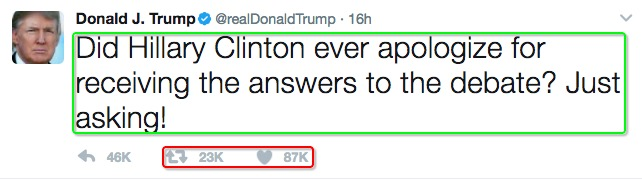

# juji hw

## Part I: Requirements analysis

>"Representative Tweets"
>
>You will be developing a working Web site that allows your users to see a twitter user's "representative tweets". At most 10 "representative tweets" must be selected from the tweets of a twitter user. You are free to devise your own implementation of "representativeness", as long as you can articulate your justification.
>
>On your site, when a user enters a person's twitter handle, your user expects to see her/his representative tweets,  as well as the evidence of their representativeness.  Feel free to improve the user experience in whatever ways you feel necessary given the time you have.
>
>Your submission includes a link to the working Web site, a link (or attachment) to the source code, and a link (or attachment) to a document where you outline and justify your choices in design and implementation. You are free to use whatever tools, resources and libraries that you have a right to use.

### Website Architecture

1. Front-end: 1 page for user to input his twitter username. 1 page for displaying user's most 10 representative tweets. 
2. Back-end: 
	+ received user's username as a request, 
	+ return user's most representative tweets as response.

possible tools: spark java as website framework. MongoDB as database.

Here is what happens on our server, since user input a twitter account, until see his top-10 representative tweets:

1. server received a twitter username.
2. server use some twitter API to download this user's most recent 1000 twitters.
3. server got the data and send them into a **"Representativeness Ranker"** so the tweets will be sorted by some ranking algorithm which I will discuss later.
4. server stores the top-10 representative tweets into local DB, also send back this computing result to browser.

### Representative Ranker
(Just an example)

+ Input: user's most recent 1000 original tweets.

+ Output: user's most representative 10 tweets.

Here the problem is how to define "representative"? What kind of tweet can mostly represent a user's personality or features?

#### Model 1: Favorite & Retweet Amount-based:
 
> tweets with higher "likes" and "retweets" amount.

I select "like" and "retweet" amount as a representative features based on the following tuitive assumptions:


+ The input data is user's original tweets (not just copy or retweet from somewhere else). 
+ A user's original tweets usually coordinate with his personality and features. 
+ Followers follow this user usually because they appreciate his personality or features.
+ Most "like" and "retweet" are from user's direct followers, or followers' followers within 2 connections.

#### Model 2: Tweet text content - based

> Representative words always appear in a user's representative tweets. Here we simply use word frequency to measure the representativeness of a word. 

This model considers the following assumption:  

+ A user with constant personality usually have obvious tendency on using some words instead of others. 
+ A word with high frequency of user's tweets usually representa user's self-evaluation,  or issues what he really cares about.


## Part II. Implementation


### Data format 

The data get from twitter is formated as @username - favorate - Retweet - Tweet text:

For example if a twitter looks like this:



Then the data what I really concern is: 

```
@realDonaldTrump -  Favorated number: 21621 -  Retweeted number: 82846 - 
 - Did Hillary Clinton ever apologize for receiving the answers to the debate? Just asking!
```

### Representativeness


#### Model 1: Favorite & Retweet amount-based

1. Collect user's most recent 300 tweets.
2. Sort them based on favorite number and retweet number. [Ranker 1](https://github.com/Nautilus1993/Juji-interview/blob/master/src/main/java/com/todoapp/Ranker1.java)
3. Return top-10 tweets as response and display at browser side. (I am working on here)
4. Add the top-10 into database. 


#### Model 2: Tweet text-based

##Part III: Deployment & Test


