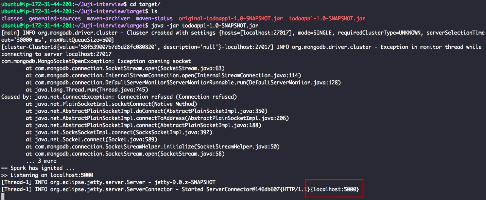
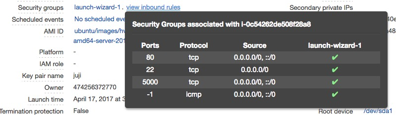
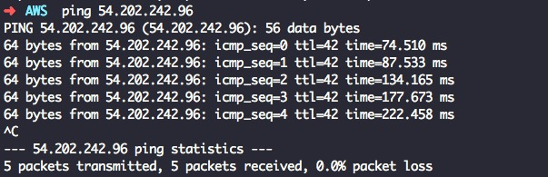

## Observations

Step 1: java -jar app.jar

Step 2: Setup instance port: allow tcp on port 5000

Step 3: Ping instance public IP: (SG allows ICMP traffic)

 

      
## Possible explanations

1. .jar is not a web application. If I want to run this project as a website, I need to run it as a .war package over a server like Tomcat/jetty.

2. I need to forward traffic from port 80 to port 5000.

